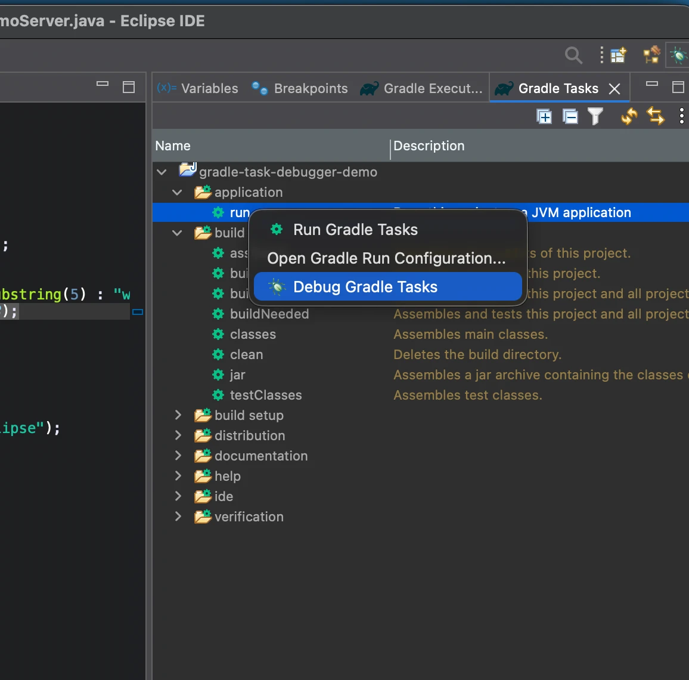
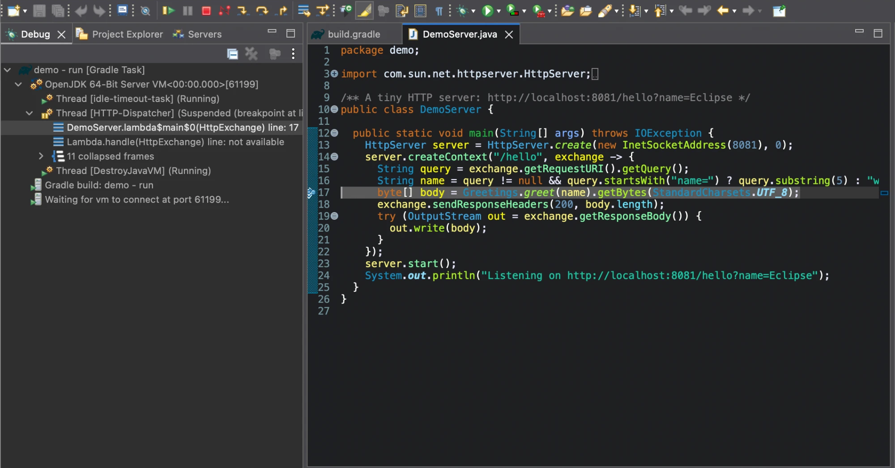

# Gradle Task Debugger for Eclipse

[](https://github.com/legrottagliegionata/eclipse-gradle-debug/releases)
[](https://github.com/legrottagliegionata/eclipse-gradle-debug/actions/workflows/build.yml)
[](LICENSE)

Debug any Gradle task from Eclipse the way IntelliJ IDEA does it: right-click a task in the
**Gradle Tasks** view, choose **Debug Gradle Tasks**, and the debugger is attached to every JVM
the build forks (`JavaExec`, `run`, `bootRun`, `test`, ...).

No *Remote Java Application*, no *Launch Group*, no fixed debug port.





## Install

From the [Eclipse Marketplace](https://marketplace.eclipse.org/content/gradle-task-debugger-eclipse):
drag this button to a running Eclipse, or search for *Gradle Task Debugger* in
*Help → Eclipse Marketplace…*

[](https://marketplace.eclipse.org/marketplace-client-intro?mpc_install=7570735 "Drag to your running Eclipse workspace. Requires Eclipse Marketplace Client")

Or in Eclipse: *Help → Install New Software… → Add…* and use the update site

```
https://legrottagliegionata.github.io/eclipse-gradle-debug/
```

Offline, download the zipped update site from the
[releases](https://github.com/legrottagliegionata/eclipse-gradle-debug/releases) and choose
*Add… → Archive…*.

Requirements: Eclipse 2024-06 or later, Buildship 3.1 or later (included in the Eclipse IDE
packages), Java 17 or later.

## Use

- **Gradle Tasks view:** right-click one or more tasks → **Debug Gradle Tasks**.
- **Run configurations:** every *Gradle Task* configuration can now be launched in debug mode too,
  from the Debug toolbar button or from *Debug Configurations…*.

Breakpoints are hit in every JVM the build starts. The **Gradle build** entry in the Debug view
stops the build; terminating a JVM stops that JVM.

## Try it

The [demo project](demo/README.md) is a small HTTP server started by the `run` task: import it,
put a breakpoint and choose **Debug Gradle Tasks** on `run`.

## How it works

The story behind the plugin, and the two Eclipse quirks it works around, is told in
[Debugging Gradle tasks in Eclipse, the way IntelliJ does it](https://dev.to/gionata_legrottaglie/debugging-gradle-tasks-in-eclipse-the-way-intellij-does-it-1a82).

1. Eclipse starts listening for debuggee JVMs on a free port.
2. Buildship runs the build exactly as in run mode, plus an
   [init script](bundles/io.github.legrottagliegionata.gradletaskdebugger/scripts/gradle-task-debugger.init.gradle)
   that configures every task implementing `JavaForkOptions` to start its JVM with the JDWP agent
   in client mode (`server=n,suspend=y`), pointing to that port.
3. Each forked JVM connects to Eclipse and waits for the debugger before running; the listener
   closes when the build ends.

Details:

- The init script sets `debugOptions` with `set()`, so it wins over conventions a build plugin may
  have configured. Gradle older than 5.6 gets the equivalent `-agentlib:jdwp` JVM argument.
- The port is read lazily from a system property, so the
  [configuration cache](https://docs.gradle.org/current/userguide/configuration_cache.html) is
  reused from one debug session to the next.
- The first debug launch of a configuration adds the standard JDT attribute
  `org.eclipse.jdt.launching.ALLOW_TERMINATE`, so that Terminate can stop the JVMs.
- Hot code replace uses the classes compiled by Gradle. The JVMs run what javac compiled, and
  Eclipse's compiler (ECJ) names lambdas and other synthetic members differently, so the JVM would
  reject its classes as methods removed and added. When a Java file is saved during a debug
  session, the plugin runs the `classes` task of its project and hands the class files Gradle
  rewrote to JDT's hot code replace, which redefines them and reinstalls the breakpoints. It takes
  as long as that Gradle compilation, and only runs when *Build Automatically* is on. Changes no
  JVM can redefine, such as new methods or fields, are reported by JDT as usual.
- Only JVMs forked by the build are debugged. To debug build logic (plugins, `buildSrc`), which
  runs in the Gradle daemon, use `-Dorg.gradle.debug=true`.
- Buildship does not export the model of the Gradle Tasks view: the plugin reads the selected
  nodes through their public getters, and is tested against Buildship 3.1.

## Build

```bash
./mvnw verify
```

The build uses [Tycho](https://github.com/eclipse-tycho/tycho) in pomless mode and needs Java 21.
The integration test imports a Gradle project, launches its `run` task in debug mode and checks
that a breakpoint is hit. Run it with Java 21 to 24: Buildship 3.1.10, in the 2024-06 target
platform, cannot import projects on Java 25. The update site is written to
`site/target/repository`.

## Release

Every push is built and tested by [GitHub Actions](.github/workflows/build.yml). A tag `v<version>`,
matching the version of the build without `-SNAPSHOT`, also publishes the update site on GitHub
Pages and creates a GitHub release with the zipped update site, for offline installs:

```bash
git tag v0.1.0 && git push origin v0.1.0
```

The update site of a release is signed with PGP, so that Eclipse shows who signed it instead of
warning about unsigned content. The release build reads the armored secret key and its passphrase
from the repository secrets `MAVEN_GPG_KEY` and `MAVEN_GPG_PASSPHRASE`, and stops if they are
missing.

The [Eclipse Marketplace listing](https://marketplace.eclipse.org/content/gradle-task-debugger-eclipse)
installs from the update site, so it always gets the latest release, but the version it shows does
not follow the tags: update it by hand in *My Marketplace → Edit*.

Then move to the next version, in the POMs, the manifests and the feature:

```bash
./mvnw tycho-versions:set-version -DnewVersion=0.2.0-SNAPSHOT
```

## License

[Eclipse Public License 2.0](LICENSE)
